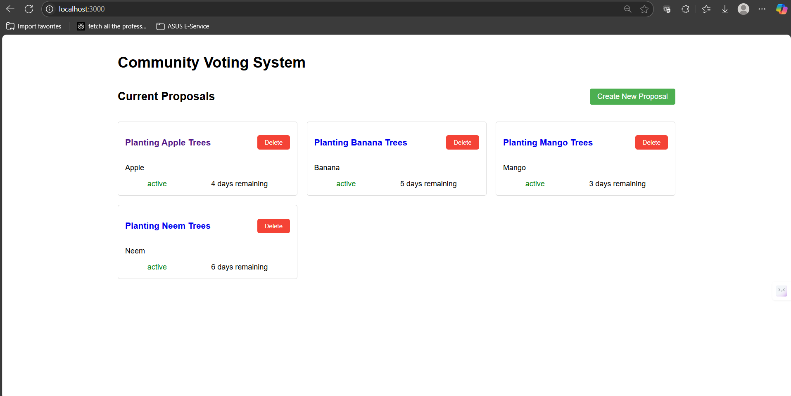
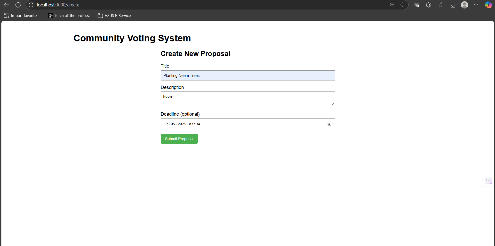
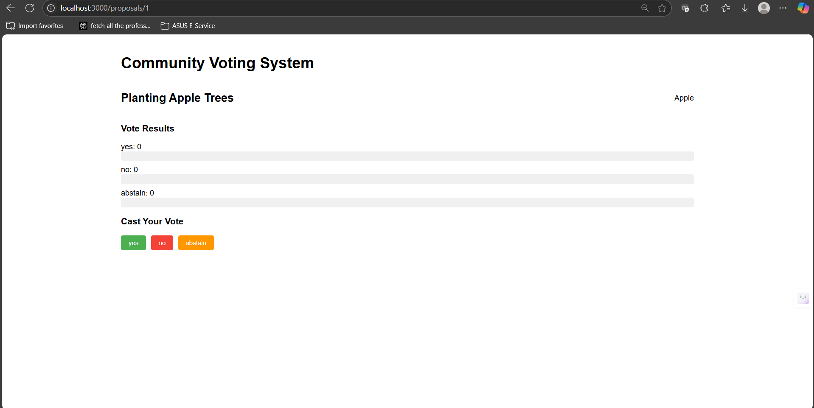
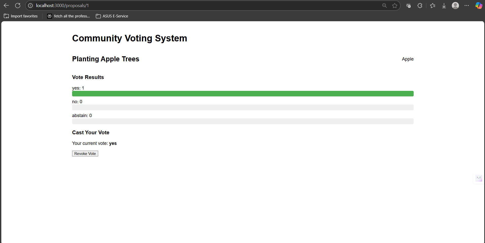
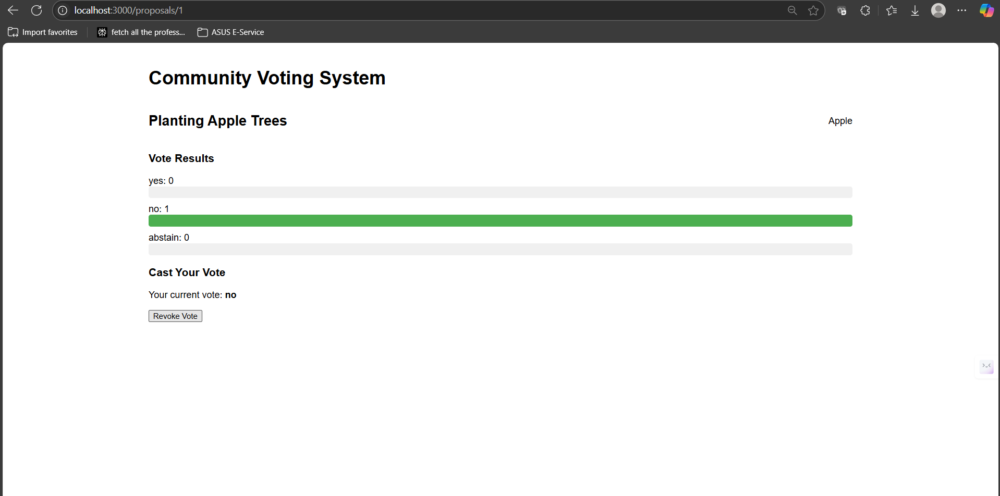

# Community Digital Voting System



A full-stack application for creating and voting on community proposals, featuring a FastAPI backend and React frontend.

## Features

### Backend (FastAPI)
- Create proposals with deadlines
- Vote on active proposals (Yes/No/Abstain)
- Revoke votes while proposals are active
- Automatic proposal expiration
- Manual proposal closure
- SQLite database with Alembic migrations
- OpenAPI 3.0 compliance

### Frontend (React)
- View active/closed/expired proposals  
  
- Create new proposals  
  
- Vote and revote functionality  
  
- Real-time proposal status updates  
    
  
- Proposal detail view with votes

## UI Demonstration

### Proposal Management
1. **Create new proposals**  
   

2. **View active proposals**  
   

### Voting Process
1. **Cast your vote**  
   

2. **See results after voting**  
   - When voting "Yes":  
     
   - When voting "No":  
     

## Technologies

- **Backend**: Python, FastAPI, SQLAlchemy, SQLite
- **Frontend**: React, Axios
- **Tools**: Alembic, OpenAPI Generator, Pytest

## Installation

### Prerequisites
- Python 3.9+
- Node.js 16+
- npm

### Setup

1. **Clone repository**
   ```bash
   git clone https://github.com/<your-username>/community-voting-system.git
   cd community-voting-system

2. **Backend setup**
    python -m venv env
    source env/bin/activate  # Linux/MacOS
    env\Scripts\activate  # Windows
    pip install -r requirements.txt
    alembic upgrade head

3. **Frontend setup**
    cd frontend
    npm install
    cd ..

### Usage

1. **Start backend**
    uvicorn app.main:app --reload

2. **Start frontend**
    cd frontend
    npm start

3. **Access application at http://localhost:3000**

### API Endpoints

| Method  | Endpoint                  | Description                  |
|---------|---------------------------|------------------------------|
| POST    | `/proposals/`             | Create new proposal          |
| GET     | `/proposals/`             | List all proposals           |
| GET     | `/proposals/{id}`         | Get proposal details         |
| POST    | `/proposals/{id}/vote`    | Submit vote                  |
| DELETE  | `/votes/{id}`             | Revoke vote                  |
| PATCH   | `/proposals/{id}/close`   | Close proposal manually      |
| DELETE  | `/proposals/{id}`         | Delete proposal              |
